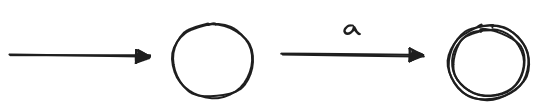
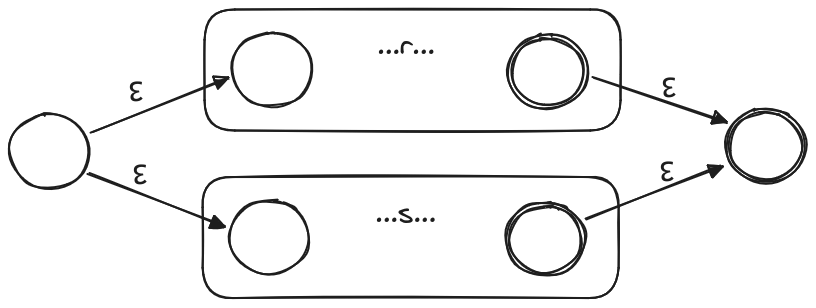
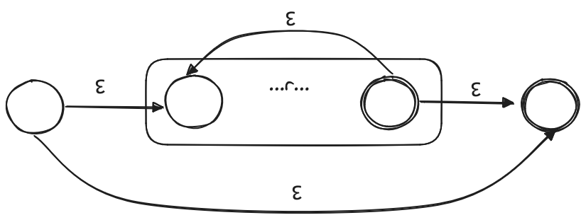

# AUTÓMATAS DE ESTADOS FINITOS

## Contenido Conceptual

### Autómatas Finitos Deterministas y No Deterministas
Los autómatas finitos son modelos matemáticos que describen sistemas que evolucionan en pasos discretos. Los autómatas finitos pueden ser deterministas (AFD) o no deterministas (AFN), y ambos se utilizan para reconocer patrones en cadenas de entrada.

### Tablas de Transición y Aceptación de Cadenas
Las tablas de transición son herramientas esenciales para representar el comportamiento de un autómata. Estas tablas muestran cómo el autómata cambia de un estado a otro en respuesta a las entradas. La aceptación de cadenas se refiere a la capacidad del autómata para reconocer y validar cadenas de entrada.

### Obtención de Autómatas a partir de Expresiones Regulares
Es posible construir autómatas a partir de expresiones regulares. Este proceso implica representar cada operación de la expresión regular mediante la conexión de autómatas finitos no deterministas (AFN) de subexpresiones más simples.

### Conversión de AFN en AFD
La conversión de un autómata finito no determinista (AFN) a uno determinista (AFD) es un paso importante para simplificar y optimizar el proceso de reconocimiento de patrones. Se utiliza la "Construcción de Subconjuntos" para realizar esta conversión.

### Diseño de Analizadores Léxicos y Estructura del Analizador
Los analizadores léxicos descomponen una secuencia de símbolos en componentes léxicos, como identificadores, palabras clave y operadores. La estructura del analizador incluye un diagrama de transiciones que describe cómo se comporta el analizador léxico frente a la entrada.

## Objetivos

1. Identificar y diferenciar autómatas finitos deterministas y no deterministas.
2. Representar e implementar autómatas para reconocer patrones en cadenas de entrada a partir de expresiones regulares.
3. Construir autómatas finitos no deterministas mediante la "Construcción de Thompson".
4. Convertir autómatas finitos no deterministas en deterministas para simplificar el reconocimiento de patrones.

## Definiciones

### Diagrama de Transiciones
Representa las acciones que tienen lugar cuando el analizador léxico es llamado por el analizador sintáctico para obtener el siguiente componente léxico.

#### Construcción del Diagrama de Transiciones:
- Las posiciones se representan con círculos llamados estados.
- Los estados se conectan mediante flechas (aristas) con etiquetas que indican los caracteres de entrada.
- El estado de inicio es el estado inicial del diagrama.
- El estado de aceptación se indica con un círculo doble.

### Construcción de Thompson
Permite obtener cada operación de la expresión regular conectando autómatas finitos no deterministas de subexpresiones.

#### Representaciones de la Construcción de Thompson:
1. **Expresiones Regulares Básicas:** `a` representa una correspondencia con un carácter simple del alfabeto.
   
   
2. **Concatenación:** AFN para la expresión regular `rs`, donde `r` y `s` son expresiones regulares.
   
   
3. **Selección de Alternativas:** AFN para la expresión regular `r|s`, donde `r` y `s` son expresiones regulares.
   
   
4. **Repetición o Cerradura de Kleene:** AFN para la expresión regular `r*`, donde `r` es una expresión regular.
   

### Construcción del Subconjunto
Para la construcción de un AFD a partir de un AFN M dado, M:
- Calculamos la cerradura ε del estado de inicio de M, convirtiéndose en el estado de inicio de M.
- Para cada conjunto subsiguiente, calculamos las transiciones en los caracteres.