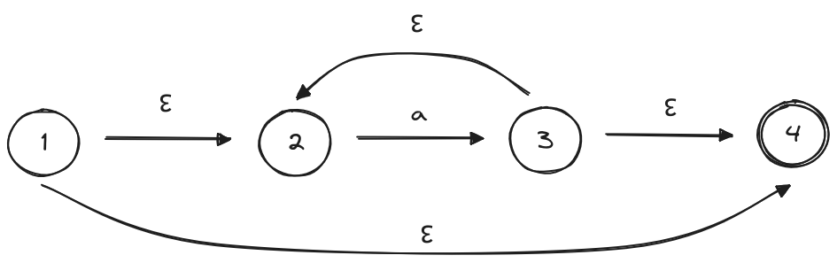

# Ejercicio 6

## Instrucciones para Visualización
Puedes visualizar las imágenes de los autómatas finitos no deterministas correspondientes a cada parte del ejercicio en la carpeta "img".

### Requisitos
- Se recomienda utilizar un visor de imágenes compatible con el formato PNG.

## Parte A

### a) Reconocer la expresión regular "a* | b a" mediante Construcción de Thompson

### b) Reconocer la expresión regular (x | y x ) * mediante Construcción de Thompson

### c) Reconocer la expresión regular a* b | a mediante Construcción de Thompson

## Ejemplo

Dada la expresión regular ( a | b )* abb, el autómata finito no determinista resultante es el siguiente:

a ; b

( a | b )
.png)

( a | b)*
".png)

( a | b )* abb
"%20abb.png)

## Parte B

### a) Convierta, utilizando construcción de subconjuntos, los autómatas finitos no
deterministas realizados en el ejercicio anterior, en autómatas finitos deterministas.

## Ejemplo
NFA que corresponde a la expresión regular a* bajo la construcción de Thompson

- El estado de inicio del DFA correspondiente es 1 = {1,2,4}
- Existe una transicion desde el estado 2 hasta el estado 3 en a, y no hay transiciones desde los estados 1 o 4 en a. {1,2,4}a = {3} = {2,3,4}
- Existe una transicion desde 2 a 3 en a y ninguna transicion a desde 3 o 4, de modo que hay una transicion desde {2,3,4}a hasta {2,3,4} = {3} = {2,3,4}
- Existe una transicion a desde {2,3,4}

No Determinista

Determinista

