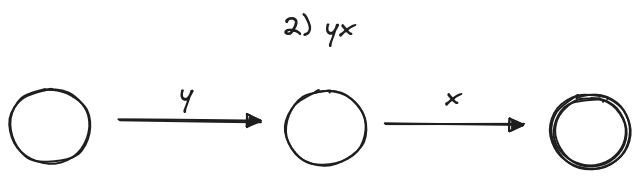
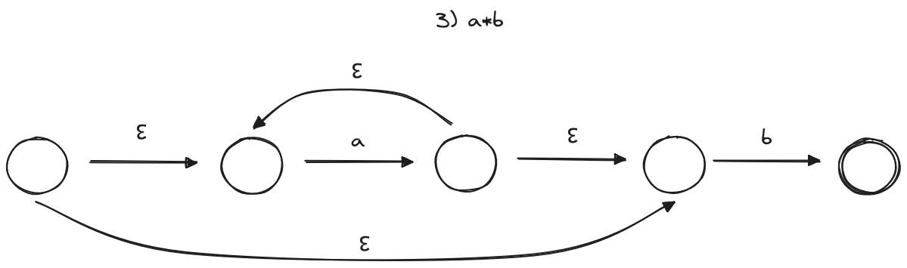

# Parte A: Autómatas Finitos No Deterministas mediante Construcción de Thompson

Este parte se centra en la construcción de autómatas finitos no deterministas (AFN) utilizando la técnica de "Construcción de Thompson". Cada parte del ejercicio corresponde a la creación de un AFN para reconocer una expresión regular específica.

## a. AFN para la expresión regular a* | b a

1) a ; b

2) b a

3) a *

4) a * | b a (conclusion)

En este ejercicio, se ha creado un AFN que reconoce la expresión regular a* | b a mediante la técnica de Construcción de Thompson.

## b. AFN para la expresión regular (x | y x ) *

1) x ; y

2) yx

3) x | yx

4) (x | yx)* (conclusion)

En este ejercicio, se presenta un AFN que reconoce la expresión regular (x | y x ) * utilizando la Construcción de Thompson.

## c. AFN para la expresión regular a* b | a

1) a ; b

2) a*

3) a*b

4) a*b | a

En este ultimo ejercicio de la primera parte, se ha construido un AFN para reconocer la expresión regular a* b | a.

# Parte B: Autómatas Finitos Deterministas
En esta parte, se llevará a cabo la conversión de autómatas finitos no deterministas (AFN) realizados en el ejercicio anterior en autómatas finitos deterministas (AFD). Se utilizará la técnica de "Construcción de Subconjuntos" para lograr esta conversión.

## a. AFD para la expresión regular a* | b a

## b. AFD para la expresión regular (x | y x ) *

## c. AFD para la expresión regular a* b | a

## Conclusiones

Este ejercicio proporciona una introducción práctica a la construcción de autómatas finitos no deterministas y deterministas para expresiones regulares específicas.

¡Esperamos que esta documentación sea de utilidad! Si tienes alguna pregunta o comentario, no dudes en comunicarte.

