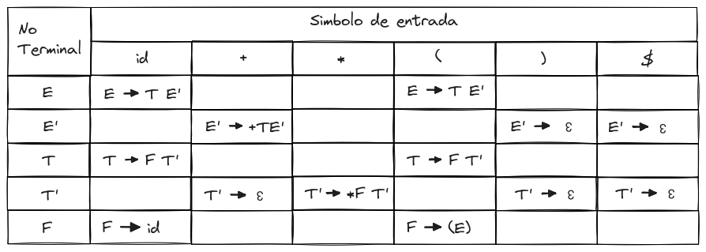
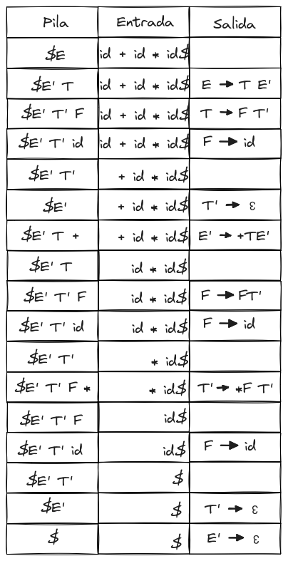
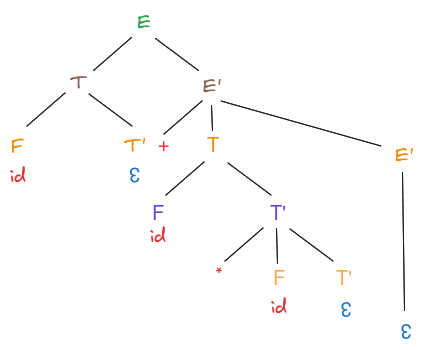

# Analizador Sintáctico Ascendente

## Contenido Conceptual

Este proyecto se enfoca en la construcción de un analizador sintáctico ascendente, abordando conceptos clave como la construcción de un árbol de análisis sintáctico, derivaciones, gramáticas LL(1), y análisis sintáctico predictivo no recursivo.

### Conceptos Clave:

- **Construcción de Árbol de Análisis Sintáctico:** Visualización de la estructura jerárquica de una expresión mediante un árbol.
- **Derivaciones:** Transformaciones sucesivas de una cadena conforme a las reglas gramaticales.
- **Gramáticas LL(1):** Gramáticas libres de contexto que pueden ser analizadas de izquierda a derecha y de arriba a abajo sin ambigüedades.
- **Análisis Sintáctico Predictivo No Recursivo:** Técnica para analizar una secuencia de tokens para determinar su estructura sintáctica.

## Objetivos

- Implementar un analizador sintáctico predictivo no recursivo en Python.
- Aplicar los conceptos de gramáticas LL(1) y análisis sintáctico predictivo no recursivo.
- Desarrollar un analizador que funcione como calculadora, evaluando expresiones aritméticas y mostrando los resultados.

## Ejercicio 1: Analizador Sintáctico para Expresiones Aritméticas

Implementar un analizador sintáctico predictivo no recursivo en Python para la siguiente gramática de expresiones aritméticas:

```
E → E + E | E - E | ( E ) | id
```

El analizador debe funcionar como una calculadora, es decir, al recibir una entrada como "10+5-2", debe mostrar el resultado correcto, que en este caso sería 13.

## Ejemplo 

### Para la Gramática de Expresiones:

```
E → E + E | E * E | ( E ) | id
```

La gramática original se transforma para eliminar la recursividad inmediata por la izquierda:

```
E → T E'
E' → + T E' | ε
T → F T'
T' → * F T' | ε
F → ( E ) | id
```

### La tabla de analisis sintactico es la siguiente:


Para la entrada "id + id * id" Obtenemos es siguiente arbol sintactico:



Diagrama:
